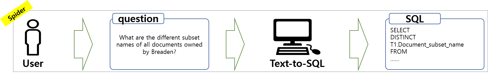

# SEED

**SEED: Enhancing Text-to-SQL Performance and Practical Usability Through Automatic Evidence Generation**

 <br />
 <br />
 <br />

## Structure
```
SEED
├── analysis
│   ├── modified_dev_evidence.json
│   └── wrong_dev_evidence.json
├── data
│   ├── bird
│   │   ├── dev
│   │   │   ├── dev_databases
│   │   │   ├── dev.json
│   │   │   ├── dev.sql
│   │   │   ├── dev_tables.json
│   │   │   └── dev_tied_append.json
│   │   └── train
│   │       ├── train_databases
│   │       ├── train_gold.sql
│   │       ├── train.json
│   │       └── train_tables.json
│   └── spider
│       ├── database
│       ├── dev_gold.sql
│       ├── dev.json
│       ├── README.txt
│       ├── tables.json
│       ├── test_database
│       ├── test_gold.sql
│       ├── test.json
│       ├── test_tables.json
│       ├── train_gold.sql
│       ├── train_others.json
│       └── train_spider.json
├── dataset
│   ├── bird_dev_gold_evi.json
│   ├── bird_dev_no_evi.json
│   ├── bird_dev_seed_evi.json
│   ├── spider_dev_no_evi.json
│   ├── spider_dev_seed_evi.json
│   ├── spider_test_no_evi.json
│   └── spider_test_seed_evi.json
├── erase_evidence.py
├── make_evidence.py
├── make_spider_description
│   ├── dev_database_desc
│   ├── spider_description.py
│   ├── step1_leave_only_dev.py
│   ├── step2_make_csv.py
│   ├── step3_run_spider_description.sh
│   └── test_database_desc
├── openai_api_key
├── README.md
├── requirements.txt
├── results
│   ├── bird
│   └── spider
├── run_make_evidence.sh
├── run_make_evidence_spider_dev.sh
└── run_make_evidence_spider_test.sh
```

## Environment Setup

**1. conda setting**
```
conda create -n SEED python=3.8.5
conda activate SEED
pip install -r requirements.txt
```

**2. make openai_api_key with your api key**
```
vi openai_api_key
sk-proj-
```

**3. download BIRD, Spider dataset**
- Download BIRD dataset in the `data/` folder. Download address: https://bird-bench.github.io/
- Download Spider dataset in the `data/` folder. Download address: https://yale-lily.github.io/spider

## Run

### Erasing evidence

**1. script setting: erase_evidence.py**
```
input_file = './data/bird/dev/dev.json'
output_file = './bird_dev_no_evi.json'
```

**2. run erase script**
```
python erase_evidence.py
```

### Generating evidence w/ SEED

#### BIRD dataset

**1. script setting: run_make_evidence.sh**
```
set -e

dataset_json_path="./data/bird/dev/dev.json"
db_path="./data/bird/dev/dev_databases"
output_path="./bird_dev_seed_evi.json"
train_json_path="./data/bird/train/train.json"
train_db_path="./data/bird/train/train_databases"
top_k=1
openai_api_key=`cat openai_api_key`

python make_evidence.py \
--dataset_json_path $dataset_json_path \
--db_path $db_path \
--output_path $output_path \
--train_json_path $train_json_path \
--train_db_path $train_db_path \
--top_k $top_k \
--openai_api_key $openai_api_key
```

**2. run generate evidence script**
```
sh run_make_evidence.sh
```

#### Spider dataset

##### dev set

**1. script setting: run_make_evidence_spider_dev.sh**
```
set -e

dataset_json_path="./data/spider/dev.json"
db_path="./data/spider/database"
output_path="./spider_dev_seed_evi.json"
train_json_path="./data/bird/train/train.json"
train_db_path="./data/bird/train/train_databases"
top_k=1
openai_api_key=`cat openai_api_key`

python make_evidence.py \
--dataset_json_path $dataset_json_path \
--db_path $db_path \
--output_path $output_path \
--train_json_path $train_json_path \
--train_db_path $train_db_path \
--top_k $top_k \
--openai_api_key $openai_api_key
```

**2. run generate evidence script**
```
sh run_make_evidence_spider_dev.sh
```

##### test set

**1. script setting: run_make_evidence_spider_test.sh**
```
set -e

dataset_json_path="./data/spider/test.json"
db_path="./data/spider/test_database"
output_path="./spider_test_seed_evi.json"
train_json_path="./data/bird/train/train.json"
train_db_path="./data/bird/train/train_databases"
top_k=1
openai_api_key=`cat openai_api_key`

python make_evidence.py \
--dataset_json_path $dataset_json_path \
--db_path $db_path \
--output_path $output_path \
--train_json_path $train_json_path \
--train_db_path $train_db_path \
--top_k $top_k \
--openai_api_key $openai_api_key
```

**2. run generate evidence script**
```
sh run_make_evidence_spider_test.sh
```

## Spider Description Generation

**1. file preparation**
Copy spider database, test_database, dev.json, and test.json to the /make_spider_description directory.

**2. make deepseek_api_key with your api key**
```
vi deepseek_api_key
sk-
```

**3. run make description script**
```
python step1_leave_only_dev.py
python step2_make_csv.py
sh step3_run_spider_description.sh
```

**4. column description copy and paste**
Paste the column description that LLM generated in json form into the csv file.
